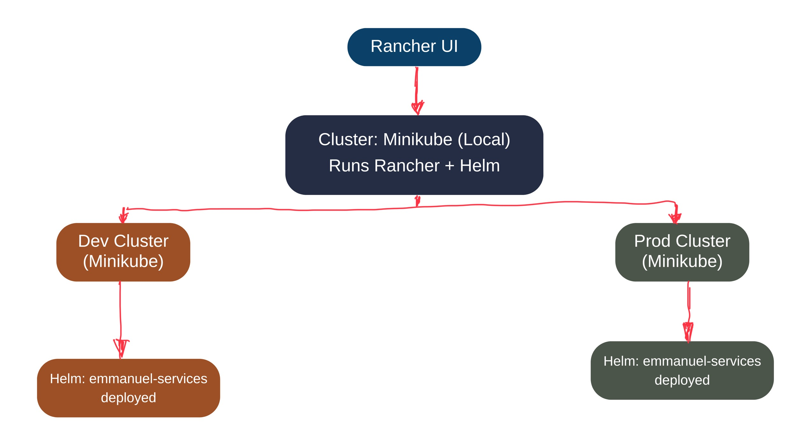

# Multi-Cluster Kubernetes Deployment Using Rancher + Minikube + Helm

This project demonstrates how to deploy the `emmanuel-services` Helm-based application in multiple Minikube clusters (dev and prod) using Rancher as the centralized UI for cluster and app management.

## Architecture Overview



### Components:
- Rancher UI: Web-based control panel to manage clusters
- Minikube (Local): Hosts Rancher + Helm
- Dev/Prod Clusters (Minikube): Simulate multi-environment setup
- Helm: Deploys `emmanuel-services` to dev/prod

## Prerequisites

Install these locally:
- Docker
- Minikube
- kubectl
- Helm

## Project Structure

```
rancher-project/
├── .github/
│   └── workflows/
│       └── deploy.yml
├── manifests/
│   └── namespace.yaml
├── rancher-setup/
│   └── install-rancher.sh
├── helm/
│   └── emmanuel-services/
└── README.md
```

## Step-by-Step Deployment Guide

### 1. Start Rancher Control Cluster

```
minikube start -p rancher-cluster --cpus=4 --memory=8192
kubectl config use-context rancher-cluster
```

### 2. Install Rancher on Minikube

```
helm repo add rancher-latest https://releases.rancher.com/server-charts/latest
helm repo update
kubectl create namespace cattle-system

helm install rancher rancher-latest/rancher \
  --namespace cattle-system \
  --set hostname=rancher.localhost \
  --set replicas=1
```

Add to your hosts file:

```
echo "127.0.0.1 rancher.localhost" | sudo tee -a /etc/hosts
```

Access Rancher UI:
```
https://rancher.localhost
```

### 3. Create Dev and Prod Minikube Clusters

```
minikube start -p dev-cluster
minikube start -p prod-cluster
```

### 4. Import Dev and Prod into Rancher

In Rancher UI:
- Go to Cluster Management > Create > Import Existing Cluster
- Name it dev-cluster, copy the provided kubectl command
- Use that command in the corresponding context:

```
kubectl config use-context dev-cluster
kubectl apply -f <import-script>
```

Repeat for prod-cluster.

### 5. Deploy emmanuel-services via Helm

In Rancher UI:
- Go to Apps > Charts > Deploy
- Select dev-cluster or prod-cluster
- Upload your chart or point to it
- Customize values.yaml and deploy

### 6. GitHub Actions Deployment (Optional)

```
# .github/workflows/deploy.yml
name: Deploy Helm App

on:
  push:
    branches: [main]

jobs:
  deploy:
    runs-on: ubuntu-latest
    steps:
      - uses: actions/checkout@v3
      - name: Set up Helm
        uses: azure/setup-helm@v3
        with:
          version: v3.12.0
      - name: Deploy Helm Chart
        run: |
          helm upgrade --install emmanuel-services ./helm/emmanuel-services \
            --namespace emmanuel-services --create-namespace
```

Add KUBECONFIG as a GitHub Secret.

## Monitor and Manage

- View app logs, events, metrics from Rancher UI
- Rollback or upgrade Helm deployments
- Scale and restart workloads

## Optional Testing (Minikube Tunnel)

```
minikube -p dev-cluster tunnel
```

---
--- 

## <div align="center">About the Author</div>

<div align="center">
  
</div>

**Emmanuel Naweji** is a seasoned Cloud and DevOps Engineer with years of experience helping companies architect and deploy secure, scalable infrastructure. He is the founder of initiatives that train and mentor individuals seeking careers in IT and has helped hundreds transition into Cloud, DevOps, and Infrastructure roles.

- Book a free consultation: [https://here4you.setmore.com](https://here4you.setmore.com)
- Connect on LinkedIn: [https://www.linkedin.com/in/ready2assist/](https://www.linkedin.com/in/ready2assist/)

Let's connect and discuss how I can help you build reliable, automated infrastructure the right way.


——

MIT License © 2025 Emmanuel Naweji

You are free to use, copy, modify, merge, publish, distribute, sublicense, or sell copies of this software and its associated documentation files (the “Software”), provided that the copyright and permission notice appears in all copies or substantial portions of the Software.

This Software is provided “as is,” without any warranty — express or implied — including but not limited to merchantability, fitness for a particular purpose, or non-infringement. In no event will the authors be liable for any claim, damages, or other liability arising from the use of the Software.
